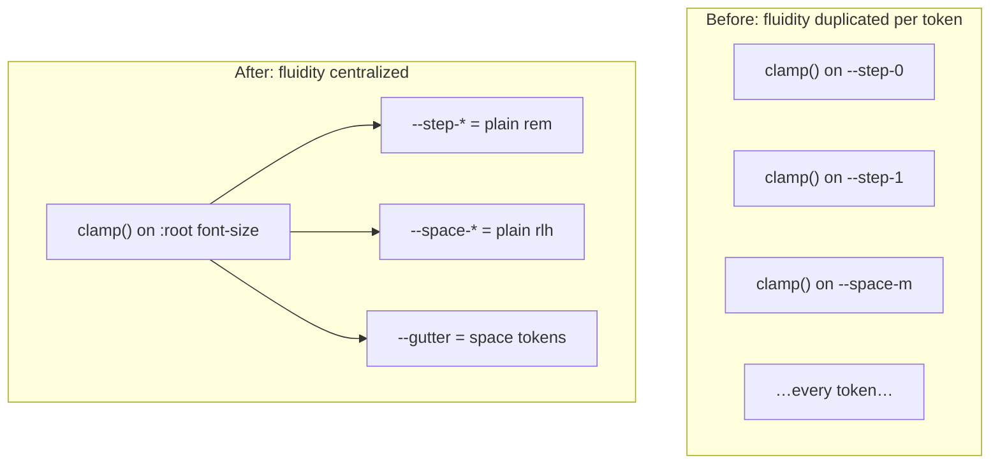

## Summary

This change replaces the site's per-token fluid type and spacing scale (a set of hand-generated Utopia `clamp()` values) with a **single fluid knob at the root**. Instead of every `--step-*` and `--space-*` token carrying its own `clamp(min, slope, max)`, only `:root { font-size }` clamps; every other token is expressed proportionally — type in plain `rem`, spacing in `rlh` (root line-heights). The result is one system driven by four plain-number knobs, so the entire scale can be re-tuned by editing a couple of values. The PR also drops the fixed site max-width in favor of token-stepped gutters, and adds a flexbox sticky-footer so short pages still push the footer to the bottom of the viewport.

## Background

> [!NOTE]
> **Fluid typography** means text (and spacing) that scales smoothly with viewport width, rather than jumping at breakpoints. The classic CSS tool is `clamp(MIN, PREFERRED, MAX)`: the browser picks `PREFERRED` (usually something like `1rem + 2vw`) but never below `MIN` or above `MAX`.

<details>
<summary>Deep background for readers new to this area (skippable)</summary>

**`rem`** is "root em" — a multiple of the root (`<html>`) font size. If the root is `16px`, `1.5rem` = `24px`. Crucially, if you change the root font size, *every* `rem` value on the page rescales with it. That is the lever this PR pulls.

**`rlh`** is "root line-height" — one line box at the root's `line-height`. If the root font-size is `16px` and root `line-height` is `1.5`, then `1rlh = 24px`. Like `rem`, it tracks the root, so spacing expressed in `rlh` stays locked to the text rhythm.

**Utopia** (utopia.fyi) is a popular method that generates a *ladder* of `clamp()` expressions — one per type step and one per space step — each interpolating between a min size at a min screen width and a max size at a max screen width. It works, but every token is an independent hand-tuned formula, so re-tuning the system means regenerating the whole ladder.

**CUBE CSS / cascade layers** — this project organizes CSS into `@layer reset, base, composition, block, utility, exception`. The design tokens live on `:root`; layout primitives like `.wrapper` and `.flow` live in the `composition` layer.
</details>

The old system (documented in `CLAUDE.md` and defined in `assets/css/main.css`) used Utopia's `320→1240px` ladder:

```css
--step-0:  clamp(1rem,     0.935rem + 0.326vw, 1.1875rem);
--step-1:  clamp(1.2rem,   1.101rem + 0.495vw, 1.4844rem);
--space-m: clamp(1.5rem,   1.402rem + 0.489vw, 1.7813rem);
/* …one bespoke clamp per token… */
--wrap-width: 920px;
```

Every step and space had its own slope and its own min/max. To change the "feel" of the scale you had to regenerate all of them together. Layout also lived partly outside the token system: `.wrapper` was capped at a fixed `920px`, and the hero had to *undo* that cap with `max-width: none`.

## Intuition

The core idea: **move all the fluidity to one place — the root font size — and let `rem` and `rlh` carry it everywhere else for free.**



Because `rem` and `rlh` are both defined relative to the root, once the root font-size scales fluidly with the viewport, *everything* scales with it — proportionally and in lockstep. The type ratio (a 1.2 minor third) stays exactly constant at every width; only the absolute size breathes.

The root clamp is built from **four plain numbers** — think of them as pixels:

| Knob | Default | Meaning |
|---|---|---|
| `--root-min` | `16` | text size (px) at the narrow end |
| `--root-max` | `24` | text size (px) at the wide end |
| `--screen-min` | `320` | viewport (px) where it stops shrinking |
| `--screen-max` | `2560` | viewport (px) where it stops growing |

The size at any width `w` is a straight line between those two points:

```
px(w) ≈ root-min + (root-max − root-min) × (w − screen-min) / (screen-max − screen-min)
```

**Toy example.** With the defaults, at `w = 1240px`:

```
16 + (24 − 16) × (1240 − 320) / (2560 − 320)
= 16 + 8 × 920 / 2240
= 16 + 3.29 ≈ 19.3px
```

So body text is ~19.3px at a 1240px viewport, ~21.3px at 1800px, clamped to 16px below 320px and 24px above 2560px. Every heading and every margin rides that same curve.

> [!TIP]
> Spacing is measured in **lines of text**, not pixels. `--space-s: 1rlh` is "one line", `--space-l: 2rlh` is "two lines", and the scale doubles every two steps (`s → l → 2xl → 4xl` = 1·2·4·8 lines). This ties whitespace directly to the text rhythm, so a denser or looser type setting automatically retunes the whitespace with it.

## Code walkthrough

### 1. The new root engine — `assets/css/main.css:16`

The heart of the change is a clamp on `:root`'s own `font-size`, plus the four knobs and a derived slope:

```css
--root-min: 16;
--root-max: 24;
--screen-min: 320;
--screen-max: 2560;

--root-slope: calc((var(--root-max) - var(--root-min)) / (var(--screen-max) - var(--screen-min)));
font-size: clamp(
  calc(var(--root-min) / 16 * 100%),
  calc((var(--root-min) - var(--root-slope) * var(--screen-min)) / 16 * 100% + var(--root-slope) * 100vw),
  calc(var(--root-max) / 16 * 100%)
);
line-height: 1.5; /* defines 1rlh */
```

Two subtle but important details:

- **Sizes are expressed as `%` of the user's default 16px, not as `px`.** That is why the formula divides by `16` and multiplies by `100%`. Using a percentage instead of an absolute `px` means a reader who bumps their browser's default font size still scales the whole page — an accessibility win that a hardcoded `px` root would break.
- **`line-height: 1.5` on the root defines the `rlh` unit** used by all spacing tokens. At the 320px floor that's `1.5 × 16 = 24px` per line.

### 2. Tokens become plain `rem` / `rlh` — `assets/css/main.css:41`

With fluidity centralized, the ladders collapse to constants:

```css
--step-0:  1rem;      /* was clamp(1rem, 0.935rem + 0.326vw, 1.1875rem) */
--step-1:  1.2rem;    /* ratio 1.2 held exactly at every width          */
--space-s: 1rlh;      /* one line of text                               */
--space-l: 2rlh;      /* two lines                                      */
```

The spacing scale also **gains steps** — `--space-3xl` (6rlh) and `--space-4xl` (8rlh) are new, and the naming shifts to a `2xs…4xl` range that doubles every two steps. This is the change reflected in the `CLAUDE.md` token table.

### 3. Gutters replace the fixed max-width — `assets/css/main.css:68` and `:247`

The old `--wrap-width: 920px` is deleted. In its place, `.wrapper` gets a `--gutter` that steps up by whole tokens at breakpoints:

```css
--gutter: var(--space-s);                                  /* 1 line  */
@media (min-width: 720px)  { :root { --gutter: var(--space-l); } }   /* 2 lines */
@media (min-width: 1200px) { :root { --gutter: var(--space-xl); } }  /* 3 lines */
@media (min-width: 1800px) { :root { --gutter: var(--space-2xl); } } /* 4 lines */
```

`.wrapper` then simplifies to `padding-inline: var(--gutter)` with no `max-width`. Because the breakpoints only swap *which token* is used, and the tokens themselves are `rlh`, the gutters still scale fluidly with the font knobs between breakpoints. This also lets the hero drop its `max-width: none` override — there's no cap left to undo.

### 4. Sticky footer — `assets/css/main.css:262` and `:275`

Independent of the scale work, `body` becomes a flex column at full viewport height and `#main` grows to fill it:

```css
body { min-height: 100vh; min-height: 100svh; display: flex; flex-direction: column; }
#main { flex: 1 0 auto; }
```

On a short page (like `/board-meeting-recaps/`), `#main` expands to absorb the leftover height, pushing the footer to the bottom of the viewport. On a tall page, `flex: 1 0 auto` still lets `#main` grow past the viewport, so the footer sits naturally below the content. The `100svh` line uses the "small viewport height" so mobile browser chrome doesn't cause a jump.

### 5. Flow spacing default tightened — `assets/css/main.css:332`

The lobotomised-owl default drops from `--space-m` (1.5 lines) to `--space-s` (1 line), a gentler default rhythm between flow siblings.

## Quiz

**1. At a viewport width of 2560px or wider, what is the computed body font size with the default knobs?**

<details>
<summary>A. 19.3px</summary>

❌ That's the size at ~1240px, mid-ramp. Past `--screen-max` the clamp pins to the max.
</details>

<details>
<summary>B. 24px</summary>

✅ `--root-max` is 24 and `--screen-max` is 2560, so at/above 2560px the upper bound of the clamp applies: 24px.
</details>

<details>
<summary>C. It keeps growing with the viewport indefinitely</summary>

❌ The `clamp()` upper bound (`--root-max`) caps growth; it does not grow past 24px.
</details>

**2. Why are the root sizes written as percentages (`… / 16 * 100%`) instead of `px`?**

<details>
<summary>A. Percentages render faster than pixels</summary>

❌ There's no performance difference; the reason is behavioral.
</details>

<details>
<summary>B. So a user's browser default-font-size preference still scales the whole page</summary>

✅ A percentage root font-size is relative to the user's default (typically 16px). A hardcoded `px` root would ignore that preference and hurt accessibility.
</details>

<details>
<summary>C. Because `vw` units require a percentage base</summary>

❌ `vw` works regardless; the percentage choice is about respecting user font settings, not `vw`.
</details>

**3. A designer changes `--root-max` from `24` to `28`. What happens to `--space-l` (`2rlh`) on a wide screen?**

<details>
<summary>A. Nothing — spacing tokens are independent of the type knobs</summary>

❌ The whole point of the redesign is that spacing is *not* independent; it rides the root.
</details>

<details>
<summary>B. It grows, because `rlh` is derived from the root font size, which now maxes out larger</summary>

✅ `rlh` = root line-height × root font-size. A larger `--root-max` raises the root at wide widths, so every `rlh`-based space token grows in proportion.
</details>

<details>
<summary>C. Only font sizes change; you'd have to edit each `--space-*` by hand</summary>

❌ That was the *old* Utopia system's pain. The new `rlh` tokens update automatically.
</details>

**4. What role does `#main { flex: 1 0 auto; }` play?**

<details>
<summary>A. It caps main's height so the footer never scrolls off-screen</summary>

❌ `flex-grow: 1` lets it expand, and `flex-shrink: 0` prevents shrinking; it does not cap height — tall content still grows past the viewport.
</details>

<details>
<summary>B. It lets main absorb leftover viewport height on short pages, pushing the footer down</summary>

✅ With `body` as a full-height flex column, `flex-grow: 1` makes `#main` fill the gap on short pages; `flex-shrink: 0` keeps it from collapsing on tall ones.
</details>

<details>
<summary>C. It centers main horizontally</summary>

❌ That would involve `margin-inline: auto` or justify/align rules, not `flex: 1 0 auto` on a column.
</details>

**5. Why could the hero drop its `max-width: none` override in this PR?**

<details>
<summary>A. The hero was removed from the layout</summary>

❌ The hero still exists; only the override line was deleted.
</details>

<details>
<summary>B. `.wrapper` no longer sets a `max-width`, so there is nothing left for the hero to override</summary>

✅ `--wrap-width` and `.wrapper`'s `max-width` were removed in favor of gutters. With no cap on `.wrapper`, the hero's `max-width: none` counter-rule became dead code.
</details>

<details>
<summary>C. The hero now uses a different layout primitive that ignores max-width</summary>

❌ The hero still uses `.wrapper`; the difference is that `.wrapper` itself no longer caps width.
</details>
